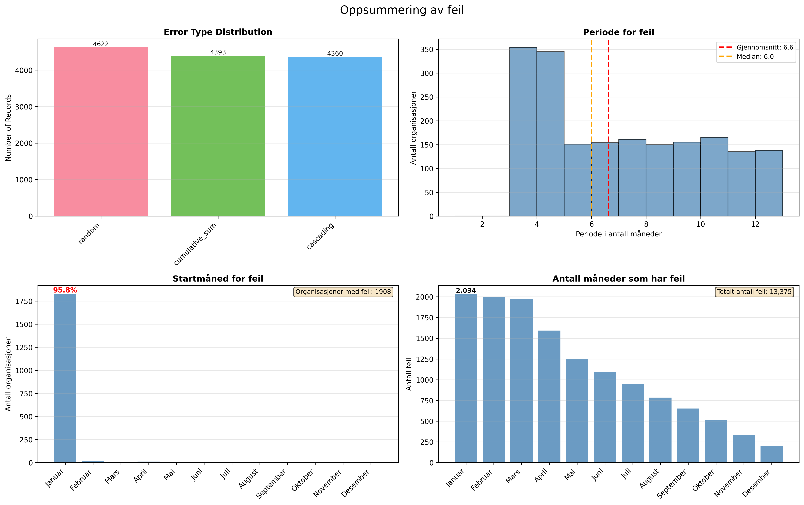

# Beskrivelse av kode

### config.py
- Python klassen Config har oversikt over ulike parametere (bøtter, kolonner i datasett, hvilke år vi skal se på, type akkumuleringsfeil, startmåned for akkumuleringsfeil med sannsynlighet, splitting av trening/validering)

### load_data.py
- load_data_year henter ut VHI data for et gitt år og lagrer det som en Pandas dataframe. 
- get_all_data brukes for å hente ut VHI data, hvilke år man ønsker å hente ut styres av parameteren "years" i Config. 

### create_accumulation_error.py
- Python klassen AccumulationErrors blir brukt for å generere akkumuleringsfeil i datasettet. Foreløpig blir det laget 3 ulike akkumuleringsfeil (se kode for beskrivelse):
    - Kumulativ sum (cumulative_sum)
    - Kaskadefeil (cascading_error)
    - Tilfeldig feil (random)
    Startmåneden Januar blir valgt med sannsynlighet 0.95. Denne verdien kan bli endret i config.

Merk at Januar ikke har akkumuleringsfeil i seg selv, men viser antall som har blitt valgt ut/startmåned. 

### base_model.py
- Generisk klasse for ulike maskinlæringsmodeller, brukt for initialisering av parametere og regne ut hvor bra modellen gjør det. Følgende metrics f1, f2, f_beta, precision, recall er inkludert. 

### time_features.py
- lager mange ulike tidsvariabler som kan være nyttige når maskinlæringsmodellen skal lære å finne akkumuleringsfeil. 

### iso_forest.py
- Isolation forest. Prøve ulike forbedringer, blant annet normalisere på bedriftsnivå og parametersøk. 

### lgb_model.py
- LightGBM. Foreløpig ikke kryssvalidering